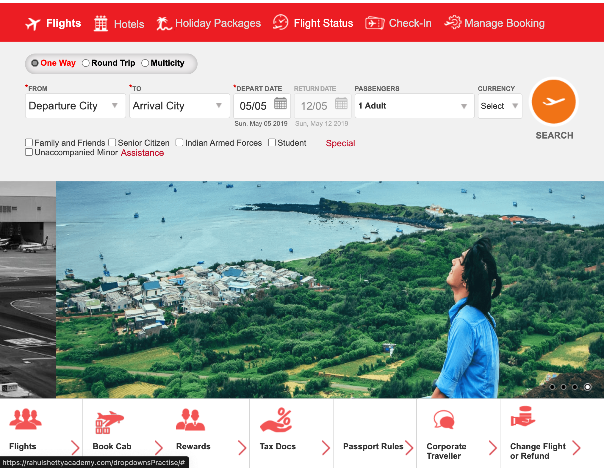

<!-- PROJECT LOGO -->
<div align="center">
  <h1 align="center">Flights Booking</h1>
  <p align="center">Web Testing Project</p>
</div>

<!-- TABLE OF CONTENTS -->
  <summary>Table of Contents</summary>
  <ol>
    <li>
      <a href="#about-the-project">About The Project</a>
      <ul>
        <li><a href="#built-with">Built With</a></li>
      </ul>
    </li>
    <li>
      <a href="#getting-started">Getting Started</a>
      <ul>
        <li><a href="#prerequisites">Prerequisites</a></li>
        <li><a href="#installation">Installation</a></li>
      </ul>
    </li>
    <li><a href="#usage">Usage</a></li>
    <li><a href="#workflow">Workflow</a></li>
    <li><a href="#useful documentation">Useful Documentation</a></li>
  </ol>

<!-- ABOUT THE PROJECT -->
## About The Project

The project focuses on testing the Flights Booking Practice website from Rahul Shetty Academy, using core testing tools such as Java, and Selenium Web Driver. The testing process is integrated with Jenkins and using TestRail to provide a comprehensive testing experience. The goal of the project is to improve testing skills and gain experience in web testing.

### Built With

* Programming Language: Java
* CI Tools: Jenkins
* Frameworks: Selenium Web Driver
* Test Management Tools: TestRail

<!-- GETTING STARTED -->
## Getting Started


### Prerequisites

- [ ] Install Java +11
- [ ] Download chromedriver and selenium server standalone
- [ ] Install Jenkins

### Installation
- [ ] Download chromedriver for your Chrome browser version, save it in Downloads.
- [ ] Download selenium-server-standalone-3.141.59.jar, save it in Downloads.
- [ ] Clone the repo.
- [ ] Run selenium standalone openning a new terminal in Downloads and run this command: java -jar selenium-server-standalone-3.141.59.jar
- [ ] Modify the -config.properties file with browsername and version.
- [ ] Add a _testdata.properties file with TestRail's credentials data (testRailUrl, testRailUsername, testRailPassword).

<!-- USAGE EXAMPLES AND STUDY CASES-->
## Usage

- [ ] Run tests from testng.xml files to create automatically a test run in TestRail.

## Implementation details

### Study case: LOGGER implementation
- Logging is a powerful aid for understanding and debugging a program’s run-time behavior. Logs capture and persist the important data and make it available for analysis at any point in time.
```
import java.util.logging.Logger;

public static final Logger LOGGER= Logger.getLogger(String.valueOf(HomePage.class));
```
### Study case: Static Dropdown
- Selenium can handle static dropdowns with the help of the Select class. A dropdown is identified with **select** tagname and its options are represented with the tagname **option**. 
- The statement - from selenium.webdriver.support.select import Select should be added to work with Select class.

```
Identify the <select> WebElement
private WebElement currencyDropdown= driver.findElement(By.xpath("locator));

Create a Select object from org.openqa.selenium.support.ui.Select and start using all its methods to select by Value, Index or Text
Select staticDropdown =new Select(currencyDropdown);
staticDropdown.selectByIndex(3);
```
### Study case: Dynamic Dropdown
- Some dropdowns are dynamic in nature which means after clicking or selecting any option, the dropdowns values would populate accordingly. And in some cases, you need to mouse hover on an element in Selenium to see the drop-down options.
- To solve this, we need to use parent-child locators to uniquely identify the elements.

```
Identify the elements uniquely, using parent-child locators. For example:
WebElement dubaiOption= driver.findElement(By.xpath("//div[@id='ctl00_mainContent_ddl_destinationStation1_CTNR']/descendant::div[@class='dropdownDiv']/ul/li/a[text()=' Dubai, All Airports(DWC) (DXB)']"));
```
### Study case: AutoSuggestive Dropdown
- Auto-suggestion or auto-complete functionality offers potential suggestions to users based on their input in a search box or any other input field on a webpage. These suggestions aim to assist users in finding relevant information or completing their input more efficiently. These are implemented as a drop-down list with a list of possible suggestions as the user proceeds to input. This helps the user select the desired term from the list without entering it completely.
- Dynamic lists of suggestions change with user input, facilitated by AJAX (Asynchronous JavaScript and XML) requests. This ensures a seamless user experience as they type, with suggestions fetched from a server or API in the background.
- The auto-suggestion list depends on asynchronous calls to show results. Sometimes, this can lead to timing issues if Selenium tries to interact with it instantly, and the suggestion list may not have fully loaded.
```
1. Enter the search term in the search box.
2. Wait for the auto-suggestion list to be available.
3. Fetch WebElement reference to all the auto-suggestions and store in a List variable of type WebElement.
4. Create a list of WebElements to catch the results of the search.
    List<WebElement> results=driver.findElements(By.xpath("//li[@class='ui-menu-item']/a"));
5.Start a loop to traverse each WebElement from the list.
    for (WebElement e:results) {
         System.out.println(e.getText());
         if (e.getText().toLowerCase().contains(match)){
            return true;
         }
    }
6. Compare if the auto-suggestion matches the required term. 
7. Assert that the search term on the results page is the same as expected or not.   
```
### Study case: Checkbox
- Handling checkboxes with Selenium
```
Create the locator identifying the checkbox and click it to select it.
WebElement familyAndFriendsCheckbox=driver.findElement(By.xpath("//div[@id='discount-checkbox']//input[contains(@id,'friendsandfamily')]"));

Assert if it is checked using the method **isSelected()**
home.selectFamilyAndFriendsDiscount().isSelected()
```
### Study case: IRetryAnalyzer
- Every time tests fail in a suite, TestNG creates a file called testng-failed.xml in the output directory. This XML file contains the necessary information to rerun only these methods that failed, allowing you to quickly reproduce the failures without having to run the entirety of your tests. Sometimes, you might want TestNG to automatically retry a test whenever it fails. In those situations, you can use a retry analyzer.
1. Create a class and build an implementation of the interface org.testng.IRetryAnalyzer
```
import org.testng.IRetryAnalyzer;
import org.testng.ITestResult;
 
public class MyRetry implements IRetryAnalyzer {
 
  private int retryCount = 0;
  private static final int maxRetryCount = 3;
 
  @Override
  public boolean retry(ITestResult result) {
    if (retryCount < maxRetryCount) {
      retryCount++;
      return true;
    }
    return false;
  }
}
```
2. Go to you test class and bind this implementation to the @Test annotation for e.g., @Test(retryAnalyzer = Retry.class)
```
import org.testng.Assert;
import org.testng.annotations.Test;
 
public class TestclassSample {
  @Test(retryAnalyzer = MyRetry.class)
  public void test2() {
    Assert.fail();
  }
}
```
### Study case: TestNG Listeners
- To monitor and influence the progress of test executions. You can amplify test automation capabilities by customizing behavior, generating comprehensive reports, and implementing dynamic test management.
- First you have to create a listeners class and implement one of the interfaces that contains the methods you need. Then you have to add the annotation @Listeners(PackageName.ClassName.class) right before your test class.
- Another way to solve it is by the testng.xml file, instead of adding Listeners to each class, you can add a <listeners> tag and will implement listeners to the entire suite.
```
<?xml version="1.0" encoding="UTF-8"?>
<!DOCTYPE suite SYSTEM "http://testng.org/testng-1.0.dtd">
 
<suite name="TestNG Listeners Suite" parallel="false">
   <listeners>
       <listener class-name="PackageName.ClassName" />
   </listeners>

   <test name="Test">
       <classes>
           <class name="PackageName.TestsClassName" />
       </classes>
   </test>
</suite>
 ```
1. ITestListener: Providing you with an easy to implement interface through a normal Java class, where the class overrides every method declared inside the ITestListener.
2. IReporter: provides an interface which helps you to customize the test report generated by TestNG. It provides generateReport method which would get invoked after execution of all the suites.
<!-- WORKFLOW -->
## Workflow

1. Check tickets assigned to you defined in the Project Management Tool (e.g. Trello)
2. Check TestRail's test case: preconditions, steps, expected results
3. Create your Feature Branch following naming convention [TCXX]-testName
4. Add components and pages as needed, implementing Page Object Model Design Pattern using Page Factory. Using the **@FindBy** annotation to initialize web element on the page. Go to you test class and initialize the elements using **initElements()**
   ```
    HomePage home= PageFactory.initElements(driver, HomePage.class);
    ```
5. Commit your changes, push them to your branch and create a pull request assigning a reviewer
6. Merge changes to master branch

<!-- USEFUL DOCUMENTATION -->
## Useful Documentation

* [Selenium](https://www.selenium.dev/documentation/overview/)
* [Selenium Github Example](https://github.com/SeleniumHQ/seleniumhq.github.io/tree/trunk/examples)
* [TestRail](https://support.gurock.com/hc/en-us)
* [Flights Booking Practice Website](https://rahulshettyacademy.com/dropdownsPractise/)
* [TestNG](https://testng.org/doc/documentation-main.html)